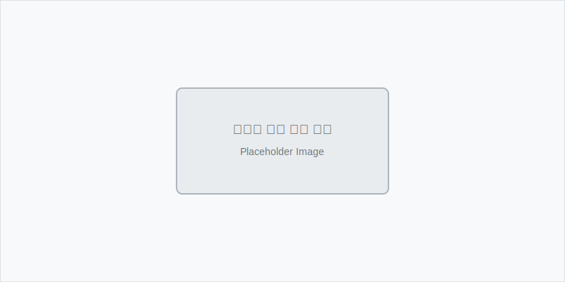
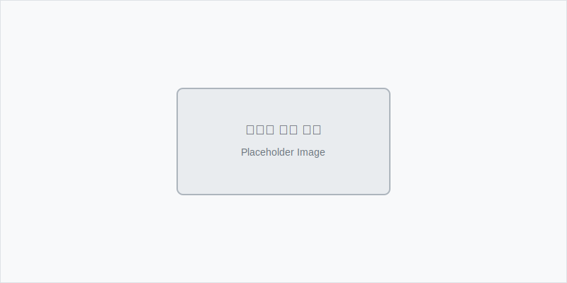

---
head:
  - - meta
    - property: og:title
      content: hiaryAI 학습 에디터 
---

# 학습 에디터

hiaryAI의 학습 에디터는 블록 기반으로 설계된 글 작성 도구입니다.

학습 기록 작성에 필요한 다양한 블록 유형을 제공하며, 텍스트, 코드, 수식, 이미지를 효과적으로 조합해서 구조화된 학습 콘텐츠를 만들 수 있어요.

## 에디터 기본 구조

### 글 작성 화면 구성

**에디터 레이아웃**



- **상단 툴바**: 저장, 발행, 미리보기 버튼
- **제목 영역**: 글 제목 입력 필드
- **태그 입력**: 글 하단의 태그 설정 영역
- **본문 에디터**: 메인 콘텐츠 작성 공간
- **우측 패널**: 발행 설정, 시리즈 선택, 공개 범위 설정

**에디터 상단 메뉴**
- **저장**: 임시저장 (자동저장도 지원)
- **미리보기**: 발행된 모습 미리 확인
- **발행하기**: 최종 발행 버튼

### 블록 시스템
hiaryAI 에디터는 '블록' 단위로 구성되어 있어요:

**텍스트 관련 블록**
- **일반 텍스트**: 기본 단락 텍스트
- **제목**: H1, H2, H3 등 계층적 제목
- **인용**: 중요한 내용 강조용 인용문
- **목록**: 번호 목록, 글머리 기호 목록

**미디어 블록**
- **이미지**: 사진, 스크린샷, 다이어그램
- **코드**: 프로그래밍 언어별 구문 강조
- **수식**: LaTeX 문법의 수학 수식
- **링크**: 외부 자료 임베드

### 슬래시(/) 메뉴 사용법

에디터에서 `/`를 입력하면 블록 추가 메뉴가 나타나요:



**빠른 블록 선택**
- `/h1`, `/h2`, `/h3`: 제목 블록
- `/code`: 코드 블록  
- `/img`: 이미지 블록
- `/math`: 수식 블록
- `/quote`: 인용문 블록

**메뉴 탐색**
- 화살표 키로 원하는 블록 선택
- Enter로 블록 삽입
- Escape로 메뉴 닫기

## 텍스트 작성과 서식

### 기본 텍스트 서식

**볼드와 이탤릭:**
- **굵게**: `**텍스트**` 또는 `Cmd/Ctrl + B`
- *기울임*: `*텍스트*` 또는 `Cmd/Ctrl + I`
- ***굵은 기울임***: `***텍스트***`

**하이라이팅과 취소선:**
- ==중요한 내용==: `==텍스트==`
- ~~취소선~~: `~~텍스트~~`

**인라인 코드:**
- `코드`: 백틱(`)으로 감싸기

### 목록과 체크리스트

**글머리 기호:**
- 항목 1
- 항목 2
 - 하위 항목
 - 하위 항목

**번호 목록:**
1. 첫 번째 항목
2. 두 번째 항목
 1. 세부 항목
 2. 세부 항목

**체크리스트:**
- [ ] 완료하지 않은 작업
- [x] 완료한 작업

::: tip 서식 단축키
- `Cmd/Ctrl + Shift + 7`: 번호 목록
- `Cmd/Ctrl + Shift + 8`: 글머리 기호 
- `Cmd/Ctrl + Shift + 9`: 체크리스트
:::

## 코드 블록 활용법

### 프로그래밍 언어 지원

120개 이상의 프로그래밍 언어를 지원해요. 언어를 지정하면 자동으로 문법 하이라이팅이 적용돼요.

**JavaScript 예시:**
```javascript
// 함수 선언과 호출
function calculateSum(a, b) {
 return a + b;
}

const result = calculateSum(5, 3);
console.log(`결과: ${result}`); // 결과: 8
```

**Python 예시:**
```python
# 클래스와 메서드 정의
class Student:
 def __init__(self, name, age):
 self.name = name
 self.age = age
 
 def introduce(self):
 return f"안녕하세요, 저는 {self.name}이고 {self.age}살입니다."

student = Student("김철수", 20)
print(student.introduce())
```

**HTML/CSS 예시:**
```html
<!DOCTYPE html>
<html>
<head>
 <style>
 .highlight {
 background-color: yellow;
 padding: 10px;
 }
 </style>
</head>
<body>
 <div class="highlight">
 <h1>제목입니다</h1>
 <p>내용입니다.</p>
 </div>
</body>
</html>
```

### 코드 블록 고급 기능

**줄 번호 표시:**
코드 블록 설정에서 줄 번호 표시를 활성화할 수 있어요.

**복사 버튼:**
모든 코드 블록에는 원클릭 복사 버튼이 있어요.

**언어 감지:**
코드를 붙여넣으면 자동으로 언어를 감지해서 하이라이팅을 적용해요.

## 수식 작성하기

### LaTeX 문법 지원

hiaryAI는 LaTeX 문법을  지원해서 복잡한 수학 수식도 아름답게 표현할 수 있어요.

**인라인 수식:**
텍스트 중간에 수식을 넣으려면 `$` 기호를 사용해요.
예: 피타고라스 정리는 `$a^2 + b^2 = c^2$` 입니다.

**블록 수식:**
독립적인 수식 블록은 `$$`를 사용해요.

```
$$
\int_{-\infty}^{\infty} e^{-x^2} dx = \sqrt{\pi}
$$
```

### 수식 예시

**분수와 근호:**
```
$$
\frac{-b \pm \sqrt{b^2 - 4ac}}{2a}
$$
```

**합과 극한:**
```
$$
\lim_{n \to \infty} \sum_{k=1}^{n} \frac{1}{k^2} = \frac{\pi^2}{6}
$$
```

**행렬:**
```
$$
\begin{pmatrix}
a & b \\
c & d
\end{pmatrix}
\begin{pmatrix}
x \\
y
\end{pmatrix}
=
\begin{pmatrix}
ax + by \\
cx + dy
\end{pmatrix}
$$
```

::: tip 수식 작성 도움
수식 문법이 어려우시면 [LaTeX 수식 에디터](https://www.codecogs.com/latex/eqneditor.php)를 활용해보세요.
:::

## 이미지와 미디어

### 이미지 추가하기

**드래그 앤 드롭:**
파일을 에디터에 직접 끌어다 놓으면 자동으로 업로드돼요.

**클립보드 붙여넣기:**
스크린샷을 찍은 후 `Cmd/Ctrl + V`로 바로 붙여넣을 수 있어요.

**URL로 추가:**
이미지 URL을 입력해서 외부 이미지를 가져올 수도 있어요.

### 다이어그램과 차트

**Mermaid 다이어그램:**
```
graph TD
 A[시작] --> B{조건 확인}
 B -->|참| C[작업 수행]
 B -->|거짓| D[종료]
 C --> D
```

**순서도와 프로세스:**
```
flowchart LR
 A[학습 기록 작성] --> B[AI 분석]
 B --> C[복습 질문 생성]
 C --> D[알림 발송]
 D --> E[복습 수행]
 E --> A
```

## 태그와 메타데이터

### 자동 태깅 시스템

**AI 기반 태그 추천:**
스탠다드 플랜 이상에서는 AI가 작성한 내용을 분석해서 관련 태그를 자동으로 제안해요.

**수동 태그 추가:**
직접 태그를 추가하거나 제안된 태그를 수정할 수 있어요.

**태그 분류:**
- **주제 태그**: #JavaScript, #Python, #디자인패턴
- **난이도 태그**: #기초, #중급, #고급 
- **유형 태그**: #개념정리, #실습, #프로젝트, #트러블슈팅

### 시리즈 관리

**시리즈 생성:**
관련된 학습 기록들을 하나의 시리즈로 묶어서 관리할 수 있어요.

예: "React 기초부터 고급까지" 시리즈
1. React 소개와 설치
2. JSX와 컴포넌트
3. State와 Props
4. 이벤트 처리
5. 생명주기 메서드

**시리즈 순서:**
드래그 앤 드롭으로 시리즈 내 순서를 자유롭게 조정할 수 있어요.

## 협업과 공유 기능

### 공개 범위 설정

**전체 공개:**
모든 사용자가 볼 수 있고, 검색에도 노출돼요.

**팔로워만:**
나를 팔로우하는 사용자들만 볼 수 있어요.

**비공개:**
본인만 볼 수 있는 개인 학습 기록이에요.

### 댓글과 피드백

**댓글 시스템:**
다른 사용자들이 질문이나 의견을 남길 수 있어요.

**실시간 번역:**
댓글도 실시간으로 번역되어 전 세계 학습자와 소통할 수 있어요.

## 에디터 활용 팁

### 효과적인 학습 기록 구조

**1. 명확한 제목 설정**
```markdown
# 2024.11.15 - React Hook useState 
```

**2. 목차 만들기**
```markdown
## 목차
1. useState란?
2. 기본 사용법
3. 주의사항
4. 실습 예제
5. 다음 학습 계획
```

**3. 핵심 내용 강조**
중요한 개념은 ==하이라이팅==하거나 **볼드 처리**해요.

**4. 실습 코드 포함**
이론만 정리하지 말고 실제로 작성한 코드도 함께 기록해요.

**5. 참고 자료 링크**
도움이 된 문서나 강의 링크를 함께 남겨요.

### 학습 분야별 템플릿

**개발 학습 템플릿:**
```markdown
# [날짜] - [기술/개념명] 학습

## 학습 목표
- 무엇을 배우려고 하는가?

## 핵심 개념
- 주요 개념 정리

## 실습 코드
```javascript
// 실제 작성한 코드
```

## 발견한 문제점
- 어려웠던 부분이나 에러

## 해결 방법
- 문제를 어떻게 해결했는지

## 다음 학습 계획
- 이어서 학습할 내용
```

**언어 학습 템플릿:**
```markdown
# [날짜] - [주제] 학습

## 새로 배운 어휘
- 단어: 뜻 (예문)

## 문법 정리
- 규칙과 예시

## 실습 문장
- 직접 만든 예문들

## 발음 노트 
- 어려운 발음이나 억양

## 복습 포인트
- 다시 연습해야 할 부분
```

## 에디터 단축키

### ⌨ 필수 단축키

| 기능 | Mac | Windows |
|------|-----|---------|
| 볼드 | `Cmd + B` | `Ctrl + B` |
| 이탤릭 | `Cmd + I` | `Ctrl + I` |
| 링크 | `Cmd + K` | `Ctrl + K` |
| 코드 블록 | `Cmd + Shift + K` | `Ctrl + Shift + K` |
| 저장 | `Cmd + S` | `Ctrl + S` |
| 실행취소 | `Cmd + Z` | `Ctrl + Z` |

### 고급 단축키

| 기능 | Mac | Windows |
|------|-----|---------|
| 블록 복사 | `Cmd + D` | `Ctrl + D` |
| 블록 삭제 | `Cmd + Shift + Backspace` | `Ctrl + Shift + Backspace` |
| 블록 이동 | `Cmd + Shift + ↑/↓` | `Ctrl + Shift + ↑/↓` |
| 전체 선택 | `Cmd + A` | `Ctrl + A` |
| 찾기 | `Cmd + F` | `Ctrl + F` |

---

## 더 알아보기

에디터를 마스터했다면 다음 단계로 넘어가세요:

- **[복습 시스템](./review-system.mdx)**: AI가 생성하는 복습 질문 활용하기
- **[대시보드](./dashboard.mdx)**: 작성한 학습 기록 분석하기 
- **[커뮤니티](./community.mdx)**: 다른 학습자들과 소통하기

::: tip 에디터 도움말
더 자세한 사용법이나 문제 해결이 필요하면:
- 📧 **기술 지원**: editor@hiary.ai
- **사용자 커뮤니티**: [community.hiary.ai](https://community.hiary.ai)
:::

hiaryAI 에디터로 더 체계적이고 효과적인 학습 기록을 만들어보세요 
