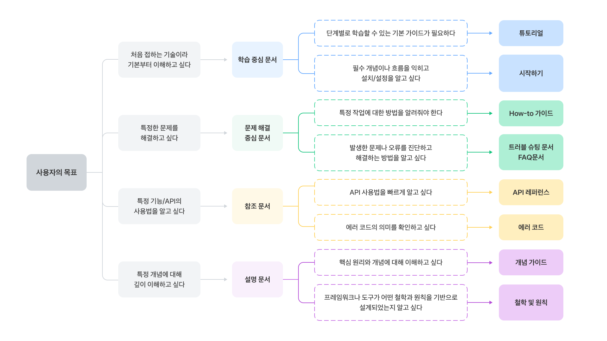

---
head:
  - - meta
    - property: og:title
      content: 문서 유형 정하기
---

# 문서 유형 정하기

기술 문서는 독자의 목적에 따라 문서 유형을 나눠볼 수 있어요. 이 유형을 알면 문서를 더 쉽게 작성할 수 있고, 독자도 필요한 정보를 빠르게 찾을 수 있어요.

여기에서는 문서를 크게 학습 중심 문서와 문제 해결 중심 문서, 참조 문서, 설명 문서 네 가지로 나누어 살펴볼게요.

| 문서 유형 | 독자의 목적 | 예시 |
|-----------|-------------------------------------|--------------------------------------|
| **학습 중심 문서** | 새로운 기술이나 도구를 처음 접해서 간단히 어떤 흐름인지 알고 싶을 때 사용해요. 초보자가 쉽게 시작할 수 있는 튜토리얼이나 사전 준비도 여기에 속해요. | [use-funnel 시작하기](https://use-funnel.slash.page/ko/docs/get-started) / [Kotlin 시작하기](https://kotlinlang.org/docs/getting-started.html) / [MDN Web Docs - HTML 기본](https://developer.mozilla.org/ko/docs/Learn_web_development/Getting_started/Your_first_website/Creating_the_content) / [토스페이먼츠 개발자센터 - 결제 연동하기](https://docs.tosspayments.com/guides/v2/payment-widget/integration) |
| **문제 해결 문서** | 배경 지식이 있는 상태에서 기술이나 도구를 사용하다 생기는 특정한 문제를 해결하고 싶을 때 사용해요. | [Stripe Docs - Collect physical addresses](https://docs.stripe.com/payments/collect-addresses) / [use-funnel - 퍼널 안에 퍼널 만들기](https://use-funnel.slash.page/ko/docs/sub-funnel) |
| **참조 문서** | 이미 기본적인 작동 방법을 알고 있는 상태에서 특정 기능이나 API 사용법을 확인해서 적용하고 싶을 때 사용해요. 특정 API 함수의 매개변수, 반환 값, 예제 코드 등을 확인하는 거에요. | [es-toolkit 레퍼런스](https://es-toolkit.slash.page/ko/reference/array/at.html) / [DevDocs JavaScript reference](https://devdocs.io/javascript/) / [MDN Web Docs - Reference](https://developer.mozilla.org/ko/docs/Web) |
| **설명 문서** | 개념, 원리, 배경 지식을 깊이 이해하고 싶을 때 사용해요. 예를 들어, 왜 이런 기술이 등장했는지, 어떤 문제를 해결하는지 등을 자세히 알고 싶을 때 사용해요. | [MDN Web Docs - 웹의 동작 방식](https://developer.mozilla.org/ko/docs/Learn_web_development/Getting_started/Web_standards/How_the_web_works) |

이렇게 목표 중심으로 문서를 분류하고 선택하면, 독자가 필요로 하는 정보와 경험을 더 효과적으로 설계할 수 있어요.

좀 더 세분화 된 다음 의사결정 트리도 한 번 참고해 보세요.



하지만 이 분류가 항상 정답은 아니에요. 더 효과적인 문서를 만들기 위해 문서 유형을 결합해서 사용할 수도 있고, 다른 방식으로 분류할 수도 있어요. 예를 들어 [JSON으로 작업하기](https://developer.mozilla.org/ko/docs/Learn_web_development/Core/Scripting/JSON) 문서는 학습 중심 문서에 속하지만, 독자가 JSON에 대한 기본적인 지식부터 이해할 수 있도록 설명 문서의 요소와 결합되어 있어요.

## 실습하기

독자가 궁금해하는 질문을 보고 가장 적절한 문서 유형을 선택해 보세요. 직접 문서 유형을 선택해 보면서 어떤 유형의 문서를 작성해야 하는지 이해해요.

::: details 🤔 JavaScript에서 this 키워드의 동작 방식을 알고 싶어요.

**👉 [설명 문서](./explaination.md): `this` 키워드의 동작 원리, 등장 배경을 설명해요.**

JavaScript의 `this` 키워드는 실행 환경에 따라 동작 방식이 달라져서 초심자가 이해하기 어려운 개념이에요. 이럴 때는 설명 문서를 작성하는 것이 적절합니다. 문서에서는 `this`의 동작 원리를 단계별로 분석하고, 왜 특정한 상황에서 `this`가 다르게 평가되는지를 정리해주면 좋아요. 또한, ES6에서 `this`를 다루는 방식이 어떻게 변화했는지, bind, call, apply 같은 메서드가 `this`를 어떻게 조작하는지도 함께 다루면 독자가 개념을 더욱 깊이 이해할 수 있어요.

:::

::: details 🤔 Webpack에서 HtmlWebpackPlugin 설정을 추가하는 방법을 알고 싶어요.

**👉 [How-To 가이드](./problem-solving.md): Webpack 설정 파일에서 HtmlWebpackPlugin을 추가하는 방법에 대한 가이드를 작성해요.**

독자가 특정 구현을 위한 구체적인 방법을 찾고 있기 때문에 How-To 문서로 작성하는 것이 적절해 보여요. Webpack 설정을 변경하거나 HtmlWebpackPlugin을 설치하는 과정, 설정 파일에 적용하는 방법, 그리고 설정이 제대로 적용되었는지 확인하는 절차를 문서에 담으면 좋을 것 같아요.

다만 가이드 문서는 플러그인을 실제 프로젝트에 통합하는 단계별 방법과 출력 관리에 초점을 맞춘 실용적 예제를 제공하고 참조 문서는 플러그인의 세부 API 및 옵션에 대한 기술적 설명을 제공하기 때문에 두 문서를 함께 제공하는 게 가장 좋을 것 같네요. 먼저 참조 문서에서 플러그인의 기능과 옵션을 이해하고, 가이드에서 실제 프로젝트에 어떻게 적용할 수 있는지 학습할 수 있도록 하면 효과적일 거예요.

공식 문서의 예시들을 참고해 보세요.

- [공식 문서 가이드](https://webpack.js.org/guides/output-management/#setting-up-htmlwebpackplugin)
- [공식 문서 레퍼런스(참조 문서)](https://webpack.js.org/plugins/html-webpack-plugin/)

::: 

::: details 🤔 React에서 'Cannot read property of undefined' 오류가 발생했을 때 해결 방법을 알고 싶어요.

**👉 [트러블슈팅 문서](./problem-solving.md): 오류 원인 분석 및 해결 방법을 정리한 문서를 작성해요.**

오류 해결을 위한 문서는 트러블슈팅 문서 형식으로 작성해요. 먼저 오류가 발생하는 원인, 어떤 상황에서 이 오류가 자주 발생하는지 정리해요. 그런 뒤 가능한 해결 방법을 제시하는게 가장 중요해요. 독자가 해결 방법을 적용했을 때 기대할 수 있는 정상적인 동작까지 설명하면 좋아요.

에러 코드 문서는 에러가 났을 때 '이 에러가 무슨 뜻이지?' 하고 찾아보는 사전에 가깝고, 트러블슈팅 문서는 '이 문제를 어떻게 해결하지?' 하고 보는 해결 가이드예요.

::: 

::: details 🤔 Node.js의 fs.readFile 함수의 options 파라미터 사용법을 알고 싶어요.

**👉 [참조 문서](./reference.md): `fs.readFile`의 매개변수, 반환 값, 예제를 작성해요.**

독자는 특정한 기능이나 API의 세부적인 사용법을 빠르게 찾고 싶어 합니다. 이럴 때는 참조 문서가 가장 적절합니다. 참조 문서는 함수의 매개변수, 옵션, 반환 값, 예제 코드 등을 체계적으로 정리해서 독자가 필요한 정보를 빠르게 찾을 수 있어요.

:::

## 유형별 템플릿 예시

### 1. 학습 중심 문서

독자가 처음부터 끝까지 따라 하면서 학습할 수 있도록 안내하는 튜토리얼 템플릿이에요.

```markdown
# [튜토리얼 제목]

## 목표

[이 튜토리얼을 따라하고 나면 독자가 달성할 목표를 간략히 설명하세요.]

## 사전 요구사항

- [이 튜토리얼을 따라 하기 전에 필요한 사전 지식, 설치해야 할 도구를 정리하세요. 없다면 생략해도 돼요.]
- [예: Node.js 버전, API 키, 필수 패키지 등]

## 단계별 가이드

### [첫 번째 단계 제목]

[이 단계에서 해야 할 작업을 설명하고 코드 예제 또는 UI 캡처를 포함하세요.]

### [두 번째 단계 제목]

[다음 단계에서 수행할 작업을 설명하세요.]

// ...

### 최종 결과 확인

[독자가 목표를 달성했을 때, 어떤 결과가 나오는지 설명하세요.]
```

### 2. 문제 해결 중심 문서

독자가 특정한 문제를 해결하거나 작업을 수행하는 방법을 설명하는 문서 템플릿이에요.

```markdown
# [문제 해결 문서 제목]

## 문제 정의

[독자가 겪을 수 있는 문제 상황을 설명하세요.]

## 사전 요구사항

[문제를 해결하기 전에 필요한 환경 설정이나 필수 조건을 정리하세요. 없다면 생략해도 돼요.]

## 해결 방법

### [첫 번째 해결 방법]

[첫 번째 해결 방법을 설명하세요.]

### [두 번째 해결 방법]

[다른 해결 방법이 있다면 추가하세요.]

### 문제 해결 후 확인 방법

[문제가 해결된 후의 모습이나 확인하는 방법을 설명하세요.]
```

### 3. 참조 문서

```markdown
# [참조 문서 제목]

## 개요
[이 요소가 무엇이며, 언제 사용하는지, 어떤 가치를 제공하는지 설명하세요.]

## 속성 및 옵션
| 속성명 | 타입 | 기본값 | 설명 |
|--------|------|--------|------|
| prop1 | string | "default" | 이 속성은 ... |

## 시그니처

[// 예제 코드]

## 반환 값

[이 함수나 API가 반환하는 값을 설명하세요.]

## 사용 예제

[어떤 상황에서 사용하는지 구체적인 예시와 함께 예제 코드를 알려주세요.]
```

### 4. 설명 문서

```markdown
# [개념명]

## 개념 소개

[이 개념이 무엇인지 간략히 설명하세요.]

## 등장 배경

[이 개념이 왜 등장했는지, 어떤 문제를 해결하는지 정리하세요.]

## 활용

[실제 프로젝트에서 이 개념이 어떻게 사용되는지 설명하세요.]
```
